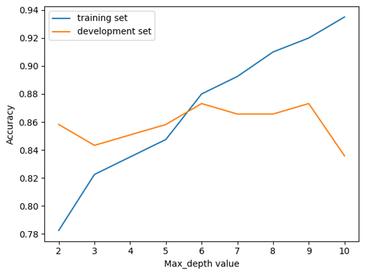

# Titanic — Exploratory Data Analysis of Survival Patterns, Decision Tree and Random Forest Survival Models

This project explores the classic Titanic dataset through a three-stage analysis: an initial **Exploratory Data Analysis (EDA)** followed by the development of **supervised machine learning models** to predict passenger survival.

Given how frequently this dataset is used, I approached the project with the intention of demonstrating **careful data handling, thoughtful reasoning, and clear interpretation**, rather than simply reproducing commonly reported results.

I found myself particularly engaged in the data cleaning stage — especially addressing missing values — and used this project to strengthen my analytical workflow and attention to detail. Building on the insights from the EDA, I then developed increasingly sophisticated predictive models, progressing from an interpretable decision tree to a higher-performing random forest.

### What's in this repository
- **Jupyter Notebooks**
  - Exploratory data analysis: `titanic.ipynb`
  - Decision tree model: `decision_tree_titanic.ipynb`
  - Random forest model: `random_forest_titanic.ipynb`
- **Images:** visualisations, tree diagrams, and reviewer feedback
- **Dataset:** Titanic passenger data
- **Requirements:** Python dependencies (`requirements.txt`)

---

## Part 1: Exploratory Data Analysis (EDA)  
`titanic.ipynb`

### Context

The first stage of the project focuses on understanding survival outcomes on the RMS Titanic through exploratory analysis. The guiding questions included:

- What factors most strongly influenced survival?
- Did passenger class affect access to lifeboats?
- Does the data support the “women and children first” principle?
- What additional patterns emerge from the dataset?

Rather than rushing to conclusions, I focused on building a clear analytical foundation before interpreting results.

### Approach and Key Insights

The EDA combines structured data cleaning with exploratory visualisation:

- **Missing data treatment:** Particular care was taken in handling missing age values, with assumptions made explicit and justified.
- **Correlation analysis:** Heatmaps were used to identify relationships between numerical variables and survival.
- **Passenger class effects:** Grouped bar charts highlighted survival advantages associated with higher passenger classes.
- **Gender and age patterns:** Stacked histograms explored differences across sex and age groups.
- **Embarkation insight:** A positive survival association with embarkation at Cherbourg was identified and traced back to class distribution rather than location alone.

Throughout the analysis, I aimed to distinguish correlation from causation and to explain *why* patterns appeared, not just *that* they did.

### Endorsement

Reviewer [feedback](./Titanic%20feedback.jpg) highlighted the **depth and thoroughness of the analysis**, with particular praise for:

- The **careful and well-reasoned handling of missing age values**
- The **comprehensive nature of the exploratory work**
- A clear, methodical approach that went beyond surface-level analysis

### Skills Demonstrated (EDA)

- Data cleaning and preprocessing  
- Thoughtful handling of missing data  
- Exploratory visualisation (heatmaps, histograms, grouped charts)  
- Analytical reasoning and interpretation  
- Python, pandas, seaborn, matplotlib, Jupyter Notebook

---

## Part 2: Decision Tree Model (Supervised Machine Learning) 
`decision_tree_titanic.ipynb`

### Model Context

Building on the insights gained during the exploratory phase, the second stage introduces a **decision tree classifier** to model passenger survival.

The goal was not only to generate predictions, but to understand how **model complexity influences performance** and how overfitting emerges in practice.

### Approach and Key Insights

Multiple decision tree configurations were explored:

- Models were trained with varying maximum depths
- Accuracy was evaluated on both training and development datasets
- Performance was analysed as a function of pruning depth

Training accuracy increased monotonically with tree depth, indicating progressively better fit to the training data.

In contrast, development accuracy displayed variability, with local maxima at **max_depth = 6 and 9**, and a noticeable decline at **max_depth = 10**. This divergence illustrates how deeper trees begin modelling noise rather than generalisable structure.

The most appropriate model depth was identified as **max_depth = 6**, balancing predictive performance with generalisation and reducing the risk of overfitting.

### Skills Demonstrated (Modelling)

- Decision tree classification  
- Model evaluation using training and development splits  
- Overfitting analysis and pruning strategy  
- Interpretation of learning behaviour  

---

## Part 3: Random Forest Model (Supervised Machine Learning) 
`random_forest_titanic.ipynb`

### Model Context

To improve upon the limitations observed in the single decision tree model, a **random forest classifier** was developed. This ensemble approach aggregates multiple trees to reduce variance and improve generalisation performance.

### Approach and Key Insights

Feature importance analysis revealed a clear separation between highly informative and low-value predictors:

- **High-importance features (> 0.1):**  
  - Passenger class  
  - Age  
  - Fare  
  - Sex (female and male indicators)

- **Low-importance features (< 0.005):**  
  - SibSp  
  - Parch  
  - Embarkation variables (C, Q, S)

These findings suggest that future models could remove low-importance features to reduce complexity and training time without compromising predictive accuracy.

Hyperparameter tuning was performed on both tree depth and the number of estimators, resulting in a final model accuracy of approximately **0.81**, representing a meaningful improvement over the standalone decision tree.

### Skills Demonstrated (Modelling)

- Random forest classification  
- Feature importance analysis  
- Hyperparameter tuning  
- Ensemble learning concepts  

---

### Requirements

Install the required Python dependencies with: `pip install -r requirements.txt` . *Note: Visualisation of decision trees requires Graphviz to be installed on the system.*

---

### Why this project belongs in my portfolio

The Titanic dataset is widely used, making it a strong benchmark for analytical judgement.

This project demonstrates a full analytical progression: beginning with exploratory understanding, moving through interpretable modelling, and culminating in an ensemble approach to improve predictive performance. Together, these stages reflect both analytical reasoning and applied machine learning fundamentals.
